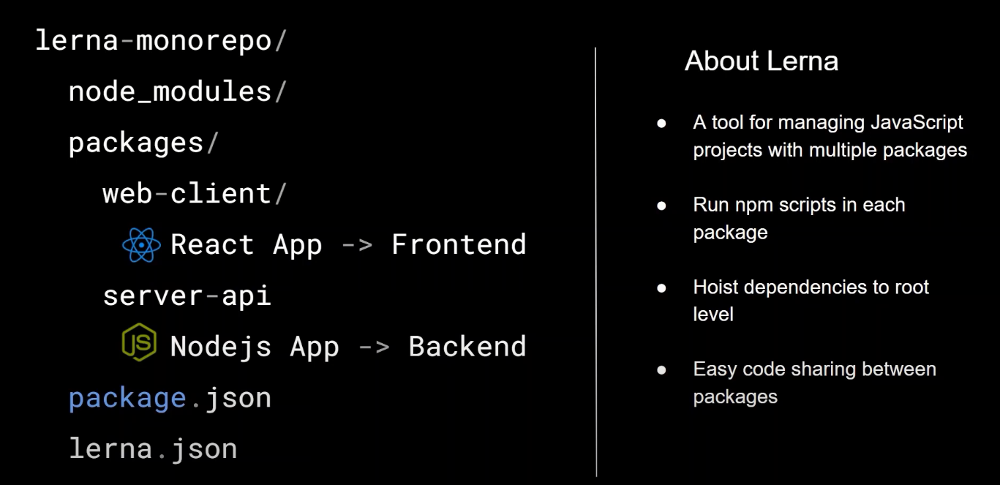

if you import/require any file from the server inside client, you will have to add that as dependencies inside the client/package.json file and also run the "yarn install"

Example:

server/index.js

`module.exports = () => console.log('I am from server');`

client/index.js

```
const serverFunc = require('server');
serverFunc();
```

now add server as dependencies inside client/package.json file

```
	"dependencies": {
		"server": "1.0.0"
	}
```

now run "yarn install" inside **client**

You can add a namespace to your custom package so you will know from which project the server package is coming in

@youprojectname/yourpackage

Example : @monorepo/server

now update the **client/package.json** file with the added namespace

```
"dependencies": {
		"@monorepo/server": "1.0.0"
	}
```

/* We used Reactjs & learna in this project. Let's see how we used that' */



to create a lerna just type **"npx lerna init"**

**npx lerna clean -y** this command will remove node_modules from the server & client

now run **npx lerna bootstrap --hoist** it checks required dependencies inside package.json file and install inside the root **node_modules**


Now we need to add few scripts on the **root package.json**

```
"scripts": {
		"start": "lerna run start",
		"test": "lerna run test",
		"new-version": "lerna version  --conventional-commits --yes",
		"diff": "lerna diff"
	},
```

these commands will run for every package inside **packages folder**

like **npm run start** will run the start script of every packager is there is any
